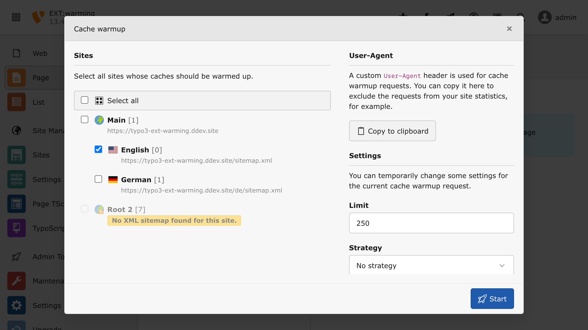

..  include:: /Includes.rst.txt

..  _backend-toolbar:

===============
Backend toolbar
===============

..  note::

    The toolbar item is only visible for admins and permitted users.
    Read how to give non-admin users access to the toolbar item at
    :ref:`permissions`.

..  _toolbar.item:

Toolbar item
============

As soon as the extension is installed, a new toolbar item in your TYPO3
backend should appear.

..  image:: ../Images/toolbar-item.png
    :alt: Cache warmup toolbar item within the TYPO3 backend

..  _cache-warmup-modal:

Cache warmup modal
==================

You can click on the toolbar item to open a modal with all available
sites listed. If a site does not provide an XML sitemap, it cannot be
used to warm up caches.

Select all sites whose caches should be warmed up and run cache warmup
by clicking on the :guilabel:`Start` button. The button is hidden by
default and will be shown once a site is selected.

..  note::

    Non-admins cannot see the :guilabel:`Settings` section within the
    cache warmup modal.

..  tip::

    The modal additionally outputs information about the `User-Agent`
    header used during the cache warmup. By clicking on
    :guilabel:`Copy to clipboard`, it can be copied to the clipboard,
    for example to exclude cache warmup requests from analyses in
    statistics tools. Take a look at the console command
    :ref:`warming-showuseragent` to learn more about the usage of the
    `User-Agent` header.
