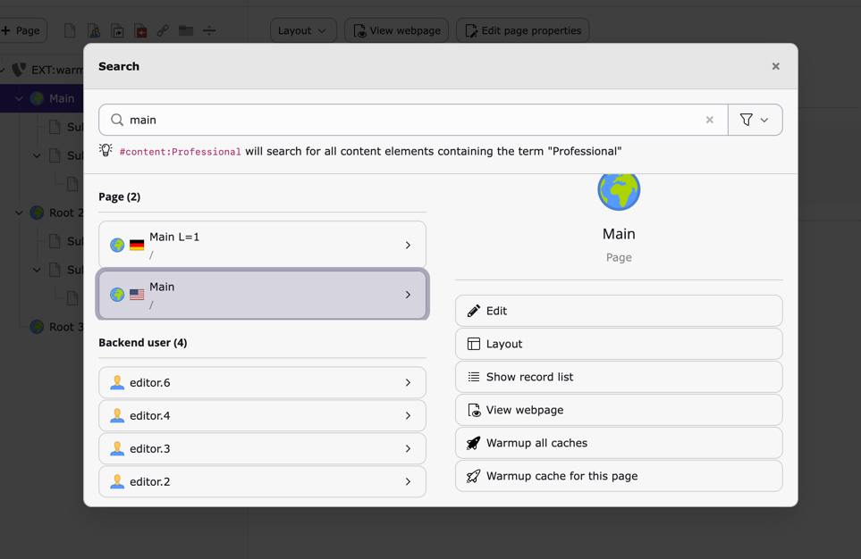

..  include:: /Includes.rst.txt

..  _live-search:

===========
Live search
===========

..  note::

    The live search result actions are only visible for admins and permitted
    users. Read how to give non-admin users access to the live search result
    actions at :ref:`permissions`.

Next to the result items in the live search, one can also trigger cache
warmup using the actions buttons on the right side:

..  note::

    The option :guilabel:`Warmup cache for this page` is available for
    all pages whereas the option :guilabel:`Warmup all caches` is only
    available for sites' root pages.
