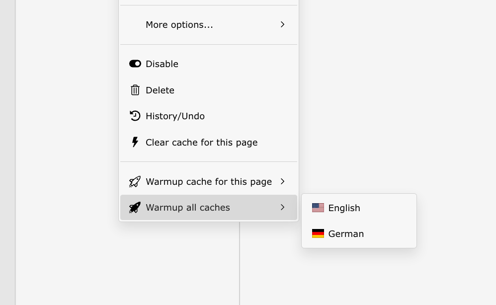

..  include:: /Includes.rst.txt

..  _page-tree:

=========
Page tree
=========

..  note::

    The context menu items are only visible for admins and permitted
    users. Read how to give non-admin users access to the context menu
    items at :ref:`permissions`.

Next to the item in the backend toolbar, one can also trigger cache
warmup using the context menu of pages inside the page tree.

..  note::

    The option :guilabel:`Warmup cache for this page` is available for
    all pages whereas the option :guilabel:`Warmup all caches` is only
    available for sites' root pages.
