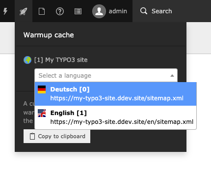
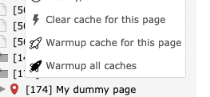
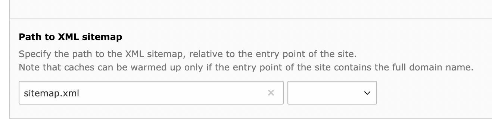

<div align="center">


# TYPO3 extension `warming`

[](https://codecov.io/gh/eliashaeussler/typo3-warming)
[](https://codeclimate.com/github/eliashaeussler/typo3-warming/maintainability)
[](https://github.com/eliashaeussler/typo3-warming/actions/workflows/tests.yaml)
[](https://github.com/eliashaeussler/typo3-warming/actions/workflows/cgl.yaml)
[](https://github.com/eliashaeussler/typo3-warming/actions/workflows/release.yaml)
[](LICENSE.md)\
[](https://extensions.typo3.org/extension/warming)
[](https://extensions.typo3.org/extension/warming)
[](https://extensions.typo3.org/extension/warming)
[](https://typo3.org/)

:package:&nbsp;[Packagist](https://packagist.org/packages/eliashaeussler/typo3-warming) |
:hatched_chick:&nbsp;[TYPO3 extension repository](https://extensions.typo3.org/extension/warming) |
:floppy_disk:&nbsp;[Repository](https://github.com/eliashaeussler/typo3-warming) |
:bug:&nbsp;[Issue tracker](https://github.com/eliashaeussler/typo3-warming/issues)

</div>

An extension for TYPO3 CMS that warms up Frontend caches based on an XML sitemap.
Cache warmup can be triggered via TYPO3 backend or using a console command.
It supports multiple languages and custom crawler implementations.

## :rocket: Features

* Warmup of Frontend caches from pages or XML sitemap
* Integration in TYPO3 backend toolbar and page tree
* Support of various sitemap providers (e.g. `robots.txt` or custom location)
* Multi-language support
* Support for custom crawlers
* Console command
* Compatible with TYPO3 10.4 LTS and 11.5 LTS

## :fire: Installation

Via Composer:

```bash
composer require eliashaeussler/typo3-warming
```

Or download the zip file from
[TYPO3 extension repository (TER)](https://extensions.typo3.org/extension/warming).

## :zap: Usage

Caches can be warmed up in two different modes – either on a **per-page** basis or
using the **XML sitemap of a site**. Currently, only one XML sitemap of a site can
be used for cache warmup.

### Toolbar item

**Note: The toolbar item is only visible for admins and permitted users.**

As soon as the extension is installed, a new toolbar item in your TYPO3 backend
should appear. You can click on the toolbar item to get a list of all sites. If a
site does not provide an XML sitemap, it cannot be used to warm up caches.



### Context menu

**Note: the context menu items are only visible for admins and permitted users.**

Next to the item in the toolbar, one can also trigger cache warmup using the context
menu of pages inside the page tree.



The option "Warmup cache for this page" is available for all pages whereas the option
"Warmup all caches" is only available for sites' root pages.

### Console command

The extension provides a console command which allows triggering cache warmup
from the command-line or by using a Scheduler task.

```bash
typo3cms warming:cachewarmup [-p|--pages <pages>] [-s|--sites <sites>] [-l|--languages <languages>] [--limit <limit>] [-x|--strict]
```

* `-p|--pages`: Define single pages to be crawled for cache warmup
* `-s|--sites`: Define site identifiers or site root pages for cache warmup
* `-l|--languages`: Define language IDs for which caches are to be warmed up
  (defaults to all available languages)
* `--limit`: Override crawl limit from [extension configuration](#extension-configuration)
* `-x|--strict`: Set this option to exit with error in case any page could not
  be crawled during cache warmup

## :open_file_folder: Configuration

### Permissions

All administrators are able to run cache warmup for sites and pages. All other users
are not allowed to run those tasks. However, you can use User TSconfig to allow
cache warmup for specific users/usergroups and sites/pages.

```typo3_typoscript
# Comma-separated list of pages to be allowed for warming up caches
options.cacheWarmup.allowedPages = 1,2,3

# Comma-separated list of site identifiers to be allowed for warming up caches
options.cacheWarmup.allowedSites = my-dummy-site,another-dummy-site
```

### Path to XML sitemap

The path to an XML sitemap is determined in three steps:

1. Site configuration: Within the Sites module, one can explicitly define the path
   to the XML sitemap of a site (see screenshot below).
2. `robots.txt`: If no path is defined in the site configuration, a possible
   `robots.txt` file is parsed for a valid `Sitemap` configuration. **Note: Only
   the first occurrence will be respected.**
3. Default path: If none of the above methods are successful, the default path
   `sitemap.xml` is used.



In order to be able to locate the sitemap path, all mentioned methods are bundled
in so-called `providers`. You are free to implement custom providers or remove ones
using a custom `Services.yaml` file. See the section
[Sitemap providers](#sitemap-providers) for more information about this topic.

### Extension configuration

The extension configuration currently provides the following configuration options:

* `limit`: Allows to limit the amount of crawled pages in one iteration. Can be
  set to `0` to crawl all pages in XML sitemap.
* `crawler`: Default crawler to be used for crawling the requested pages. Note
  that custom crawlers must implement
  [`EliasHaeussler\CacheWarmup\Crawler\CrawlerInterface`][1].
* `verboseCrawler`: Verbose crawler to be used for cache warmup from the
  command-line. Note that custom verbose crawlers must implement
  [`EliasHaeussler\CacheWarmup\Crawler\VerboseCrawlerInterface`][2].

[1]: https://github.com/eliashaeussler/cache-warmup/blob/main/src/Crawler/CrawlerInterface.php
[2]: https://github.com/eliashaeussler/cache-warmup/blob/main/src/Crawler/VerboseCrawlerInterface.php

### Crawler

There exist two dedicated crawlers: one to run the cache warmup from the backend
([`ConcurrentUserAgentCrawler`](Classes/Crawler/ConcurrentUserAgentCrawler.php))
and another one to use when running from the command-line
([`OutputtingUserAgentCrawler`](Classes/Crawler/OutputtingUserAgentCrawler.php)).

Both crawlers define their own `User-Agent` header, which generates a hash from the
encryption key of the TYPO3 installation. This `User-Agent` header can be copied in
the dropdown of the toolbar item in the backend to exclude such requests from the
statistics of analysis tools, for example.

Alternatively, the command `warming:showuseragent` can be used to read the
`User-Agent` header.

### Sitemap providers

The path to XML sitemaps is located using various path providers. All providers
implement the [`ProviderInterface`](Classes/Sitemap/Provider/ProviderInterface.php).

The [`SitemapLocator`](Classes/Sitemap/SitemapLocator.php) is fed by a list of
providers. That list is configured in the service container using the `Services.yaml`
file.

All providers will be processed in natural order, meaning the provider with the
lowest array index will be processed first. If any provider returns a valid
[`SiteAwareSitemap`](Classes/Sitemap/SiteAwareSitemap.php) object, the remaining
providers won't be processed.

You are free to modify or extend the list of path providers. Keep in mind that the
[`DefaultProvider`](Classes/Sitemap/Provider/DefaultProvider.php) should always
be used as last provider since it always returns a `SiteAwareSitemap` object.

```yaml
# Configuration/Services.yaml

services:
  # ...
  EliasHaeussler\Typo3Warming\Sitemap\SitemapLocator:
    public: true
    arguments:
      $providers:
        - '@My\Vendor\Sitemap\Provider\MyCustomProvider'
        - '@EliasHaeussler\Typo3Warming\Sitemap\Provider\DefaultProvider'
```

## :technologist: Contributing

Please have a look at [`CONTRIBUTING.md`](CONTRIBUTING.md).

## :gem: Credits

The extension icon ("rocket") as well as the icons for cache warmup actions are
modified versions of the original
[`actions-rocket`](https://typo3.github.io/TYPO3.Icons/icons/actions/actions-rocket.html)
icon from TYPO3 core which is originally licensed under
[MIT License](https://github.com/TYPO3/TYPO3.Icons/blob/main/LICENSE).

## :star: License

This project is licensed under [GNU General Public License 2.0 (or later)](LICENSE.md).

[](https://app.fossa.com/projects/git%2Bgithub.com%2Feliashaeussler%2Ftypo3-warming?ref=badge_large)
